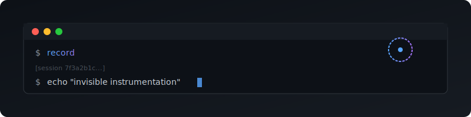

<p align="center">
  
</p>

<p align="center">
  <strong>Invisible PTY instrumentation</strong>
</p>

---

A transparent PTY wrapper that exposes a Unix socket API for terminal introspection. Run any command inside `record` and gain programmatic access to its scrollback buffer, cursor position, and input injection—without modifying the command itself.

## Use Case

**AI terminal agents** (like Claude Code) can monitor and interact with long-running processes:

```
┌─────────────────────────────────────────────────────────────┐
│  Terminal                                                   │
│  ┌───────────────────────────────────────────────────────┐  │
│  │ $ record                                              │  │
│  │ [session abc123...]                                   │  │
│  │ $ npm run dev                                         │  │
│  │ Server running on http://localhost:3000               │  │
│  │ █                                                     │  │
│  └───────────────────────────────────────────────────────┘  │
└─────────────────────────────────────────────────────────────┘
                           │
                           │ Unix Socket
                           ▼
┌─────────────────────────────────────────────────────────────┐
│  AI Agent                                                   │
│  • Read scrollback: "Server running on..."                  │
│  • Inject commands: "curl localhost:3000"                   │
│  • Monitor output in real-time                              │
└─────────────────────────────────────────────────────────────┘
```

## Install

```sh
# nix
nix run github:andrewgazelka/record

# cargo
cargo install --git https://github.com/andrewgazelka/record
```

## Usage

```sh
# Start instrumented shell
record

# Run specific command
record htop
record ssh server
record npm run dev
```

## Client

```sh
# List active sessions
record-client list

# Get scrollback (last 100 lines)
record-client scrollback -l 100

# Inject input
record-client inject "echo hello"

# Get terminal size
record-client size
```

## Protocol

Clients connect via Unix socket at `~/.record/<session-id>.sock` and send JSON:

```json
{"type": "get_scrollback", "lines": 50}
{"type": "get_cursor"}
{"type": "get_size"}
{"type": "inject", "data": "ls -la\n"}
{"type": "subscribe"}
```

## License

MIT
